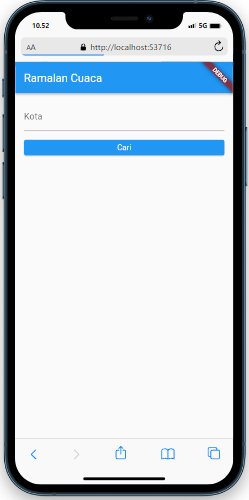

# Uas_PemrogramanMobile2
## Profil
| #               | Biodata              |
| --------------- | -------------------- |
| **Nama**        | Basri Sangaji        |
| **NIM**         | 312110152            |
| **Kelas**       | TI.21.A.1            |
| **Mata Kuliah** | Pemrograman Mobile 2 |

### Alamat API
| Nama API                        | Developer  |                          URL                          | Status  | Deskripsi                                                  |  `Auth`  |
| ------------------------------- | :--------: | :---------------------------------------------------: | :-----: | :--------------------------------------------------------- | :------: |
| API Cuaca Realtime |    weatherapi    |            [Link](https://www.weatherapi.com/)             | `Aktif` | Ramalan Cuaca Terkini Berbagai Kota dengan Format JSON                        | `apiKey` |

### Langkah-langkah
<p>1.Pastikan Anda telah menginstal Flutter dan mengatur proyek Flutter baru. Jika belum, Anda dapat mengunjungi situs resmi Flutter (https://flutter.dev) untuk informasi lebih lanjut.
<p>2.Masukkan kode dibawah ini di file main.dart :

```
import 'package:flutter/material.dart';
import 'package:http/http.dart' as http;
import 'dart:convert';

void main() {
  runApp(MyApp());
}

class MyApp extends StatelessWidget {
  @override
  Widget build(BuildContext context) {
    return MaterialApp(
      title: 'Ramalan Cuaca',
      theme: ThemeData(
        primarySwatch: Colors.blue,
      ),
      home: MyHomePage(),
    );
  }
}

class MyHomePage extends StatefulWidget {
  @override
  _MyHomePageState createState() => _MyHomePageState();
}

class _MyHomePageState extends State<MyHomePage> {
  final TextEditingController _kotaController = TextEditingController();
  String _apiKey = '0b43249881e54ea892b52342230507';
  Map<String, dynamic>? _weatherData;

  void _getWeatherData() async {
    String kota = _kotaController.text.trim();
    String url =
        'http://api.weatherapi.com/v1/current.json?key=$_apiKey&q=$kota';

    try {
      final response = await http.get(Uri.parse(url));

      if (response.statusCode == 200) {
        final data = jsonDecode(response.body);
        setState(() {
          _weatherData = data;
        });
      } else {
        showDialog(
          context: context,
          builder: (BuildContext context) {
            return AlertDialog(
              title: Text('Error'),
              content: Text('Terjadi kesalahan dalam mengambil data cuaca.'),
              actions: [
                TextButton(
                  onPressed: () {
                    Navigator.of(context).pop();
                  },
                  child: Text('OK'),
                ),
              ],
            );
          },
        );
      }
    } catch (e) {
      showDialog(
        context: context,
        builder: (BuildContext context) {
          return AlertDialog(
            title: Text('Error'),
            content: Text('Terjadi kesalahan dalam mengambil data cuaca.'),
            actions: [
              TextButton(
                onPressed: () {
                  Navigator.of(context).pop();
                },
                child: Text('OK'),
              ),
            ],
          );
        },
      );
    }
  }

  @override
  Widget build(BuildContext context) {
    return Scaffold(
      appBar: AppBar(
        title: Text('Ramalan Cuaca'),
      ),
      body: Padding(
        padding: EdgeInsets.all(16.0),
        child: Column(
          crossAxisAlignment: CrossAxisAlignment.stretch,
          children: [
            TextField(
              controller: _kotaController,
              decoration: InputDecoration(
                labelText: 'Kota',
              ),
            ),
            SizedBox(height: 16.0),
            ElevatedButton(
              onPressed: _getWeatherData,
              child: Text('Cari'),
            ),
            SizedBox(height: 16.0),
            if (_weatherData != null)
              Card(
                child: Padding(
                  padding: EdgeInsets.all(16.0),
                  child: Column(
                    children: [
                      Text(
                        _weatherData!['location']['name'],
                        style: TextStyle(
                          fontSize: 24.0,
                          fontWeight: FontWeight.bold,
                        ),
                      ),
                      SizedBox(height: 8.0),
                      Text(
                        'Suhu: ${_weatherData!['current']['temp_c']}°C',
                        style: TextStyle(
                          fontSize: 16.0,
                        ),
                      ),
                      SizedBox(height: 8.0),
                      Text(
                        'Cuaca: ${_weatherData!['current']['condition']['text']}',
                        style: TextStyle(
                          fontSize: 16.0,
                        ),
                      ),
                      SizedBox(height: 8.0),
                      Text(
                        'Kelembaban: ${_weatherData!['current']['humidity']}%',
                        style: TextStyle(
                          fontSize: 16.0,
                        ),
                      ),
                    ],
                  ),
                ),
              ),
          ],
        ),
      ),
    );
  }
}
```
<p>3.Jalankan aplikasi dengan menjalankan perintah flutter run pada terminal di direktori proyek Anda.
  
### Outputnya
<p>Ini adalah tampilan sebelum diinput nama kotanya.<br>
  


<p>Ini adalah tampilan sesudah diinput nama kotanya.<br>
  


